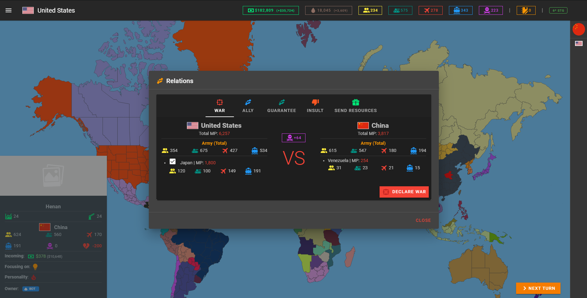
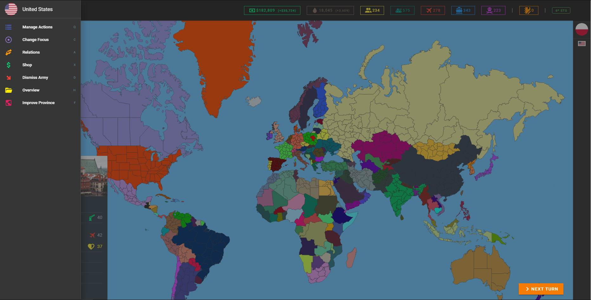
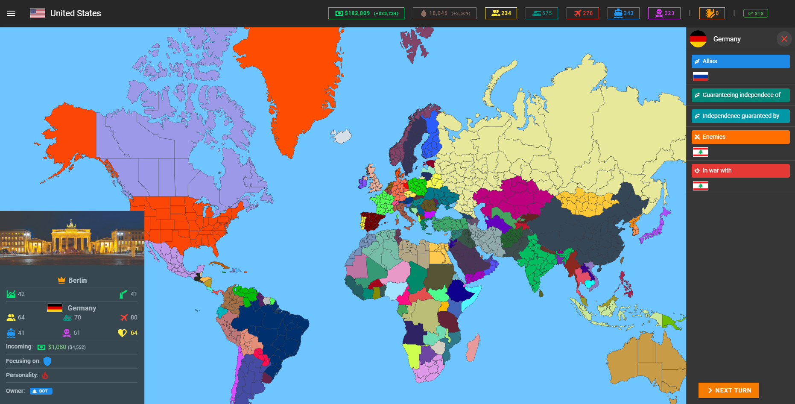
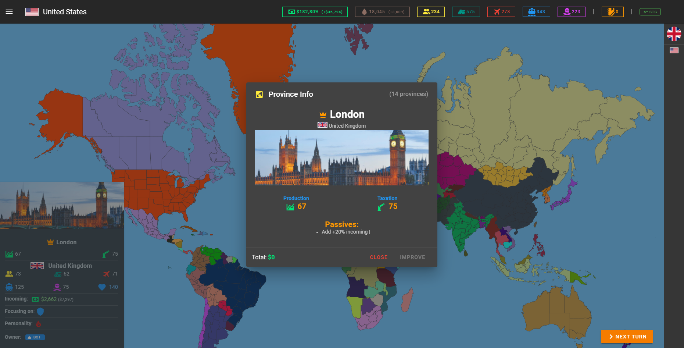
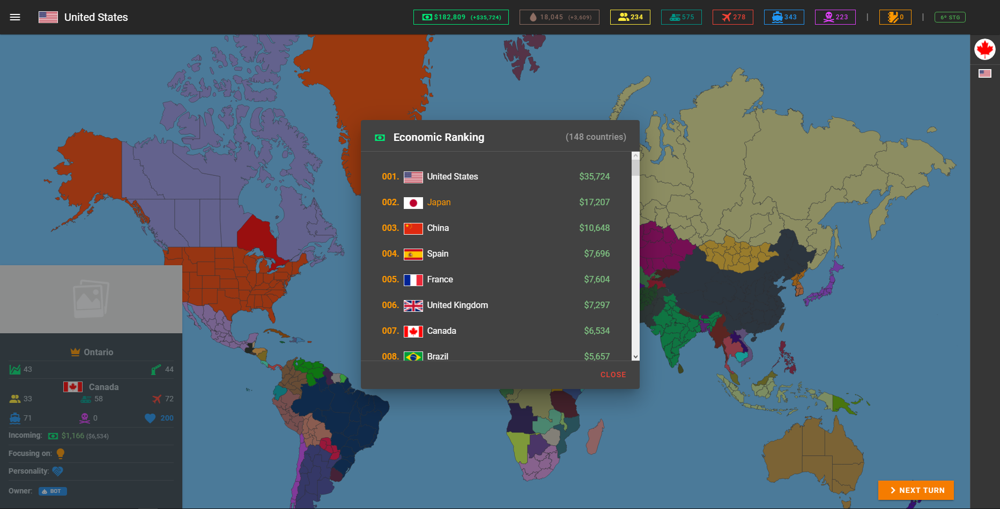
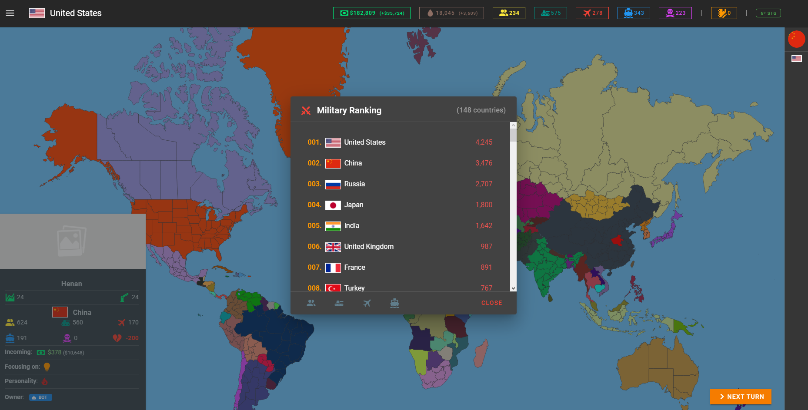
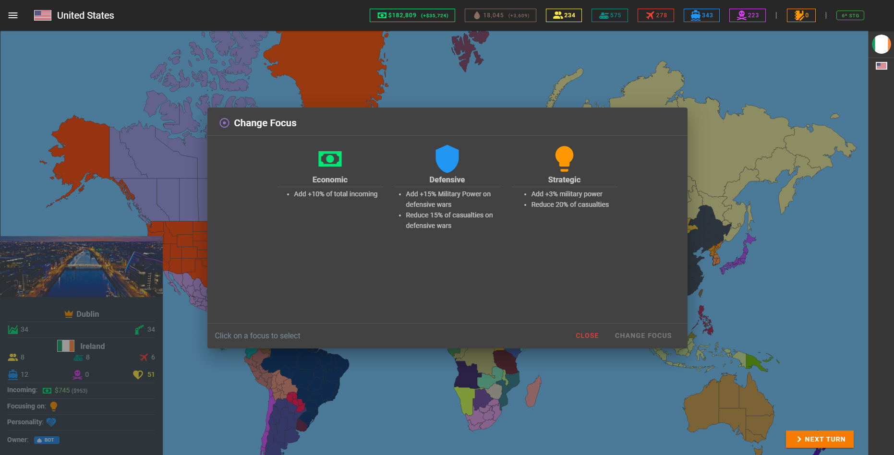
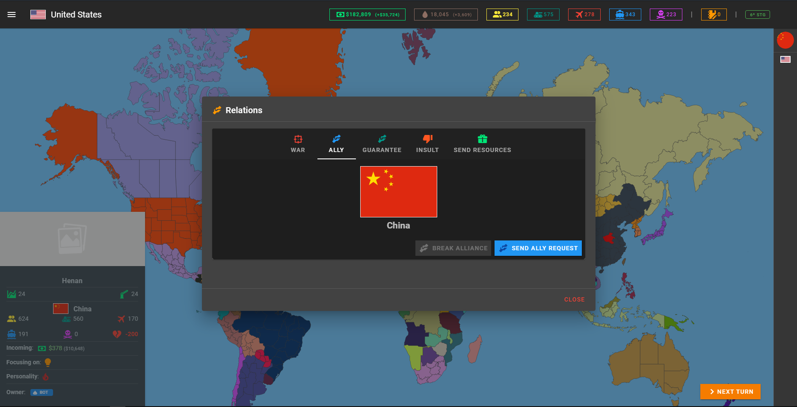
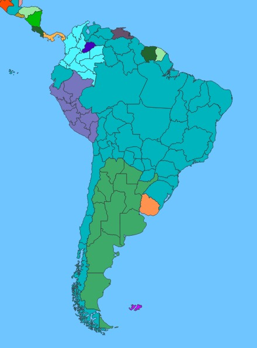

<h1 align="center">
	🗺️ Age of Wars 🗺️
</h1>

<h1 align="center">
  
</h1>

# 📜 Description

Age of Wars is a single/multiplayer strategy game that uses `Node`, `Vue` and `Socket.io`.
You start by choosing a country and then you can conquer all the world or make your country
the richest/strongest.

There are currently 149 countries available to play with.

# 📝 Quick Start

## API Setup
1. Use `docker-compose up` in the `api/` directory to set up the PostgreSQL database
2. Go to `api/.env` file and change the database connection information
3. Navigate to `api/` directory and use `yarn` to install dependencies
4. Use `yarn serve` to start the API server (development mode)

## Webapp Setup
1. Change default API URL in `webapp/src/main.js`, `webapp/src/store/index.js` and `webapp/src/plugins/axios.js`
2. Navigate to `webapp/` directory and use `npm install` to install dependencies
3. Use `npm run serve` to start the webapp (development mode)

# ➕ Installation / Requirements

These technologies listed below are required to run the project properly:

- Docker (for PostgreSQL database)
- Node (tested with Node v14.17)
- Yarn (for API)
- NPM (tested with v6.14, for webapp)

## API Installation
Navigate to `api/` directory and run `yarn` to install dependencies.

## Webapp Installation
Navigate to `webapp/` directory and run `npm install` to install dependencies.

# 🔨 Setting up PostgreSQL database

Start docker then navigate to the `api/` directory and use `docker-compose up` to set up the database.
You can access the database using `pgAdmin` by accessing the app url and the port configured in `api/.env` file.

# 🚀 Running the app (development mode)

After installing the dependencies and setting up the database:

1. **Start the API server**: Navigate to `api/` directory and run `yarn serve`
2. **Start the webapp**: Navigate to `webapp/` directory and run `npm run serve`

# 🖼️ Game Images

<h2 align="center">
	Left Sidebar (Player Actions)
</h2>

<h1 align="center">
  
</h1>

<h2 align="center">
	Right Sidebar (Target Info)
</h2>

<h1 align="center">
  
</h1>

<h2 align="center">
	Province Info
</h2>

<h1 align="center">
  
</h1>

<h2 align="center">
	Rankings
</h2>

<h1 align="center">
  
</h1>

<h1 align="center">
  
</h1>

<h2 align="center">
	Focus
</h2>

<h1 align="center">
  
</h1>

<h2 align="center">
	Declare War
</h2>

<h1 align="center">
  
</h1>

<h2 align="center">
	Send Ally Request
</h2>

<h1 align="center">
  
</h1>

<h2 align="center">
	Provinces conquered
</h2>

<h1 align="center">
  
</h1>

# Glossary

| Term                | Meaning                                                                                                                                               |
| ------------------- | ----------------------------------------------------------------------------------------------------------------------------------------------------- |
| Action              | Actions are made by players and bots (AI), an action can be `declare war`, `improve province`, etc                                                    |
| Aggressiveness      | Aggressiveness points show how much aggressive a country is. The more aggressive a country is, more chances of a coalition being created against them |
| Coalition           | A type of alliance created by countries against countries that are too much aggressive                                                                |
| Decisions           | Options for a country to accept or not alliances, demand provinces after win wars, etc                                                                |
| Focus               | Focus gives to your country new passives that can increase your economy incomings or MP                                                               |
| MP (Military Power) | Your country's power in wars. Couting with all your army                                                                                              |
| Passive             | Passives increase or decrease your economy incoming, power, etc                                                                                       |
| Personality         | Define if the countries controlled by AI will be a pacific or aggressive country, making less or more wars                                            |
| Province            | A territory controlled by a country that gives money and produces oil                                                                                 |

# ⚠️ Note

This project still under development, bugs can be faced while playing, however, you can play the game yet.

# To Do

- [ ] Create `.env` file for webapp
- [ ] Improve code quality, reduce duplicated code, add components
- [ ] Add factories and usage for oil
- [ ] Add Missions
- [ ] Add Pathways (AI)
- [ ] Add Game Event Log
